- [Node-Voltage analysis](#node-voltage-analysis)
    - [Step 1](#step-1)
    - [Step 2](#step-2)
    - [Step 3](#step-3)
    - [Notes](#notes)
    - [Example](#example)
        - [Ex 1](#ex-1)
        - [Ex 2](#ex-2)
        - [Ex 3](#ex-3)
        - [Ex 4](#ex-4)
- [Supernodes](#supernodes)
    - [Type 1](#type-1)
    - [Type 2](#type-2)
    - [Examples](#examples)
        - [Ex 1](#ex-1)
- [Special Case II: Dependent Source](#special-case-ii-dependent-source)
    - [Example](#example)
        - [Ex1](#ex1)
        - [Ex2](#ex2)
- [Excercies](#excercies)
    - [Question 1](#question-1)
    - [Question 2](#question-2)

Although the series/ parallel equivalents and voltage/ current division principles are important concepts, but they are not suficient to solve all circuit problems
- Node-voltage analysis
- Mesh-current analysis

It provides a general procedure for analysing circuit using node voltages as circuit variables.
a) Easier
b) More methodical
c) Ohm's law, KCS, KVL

# Node-Voltage analysis

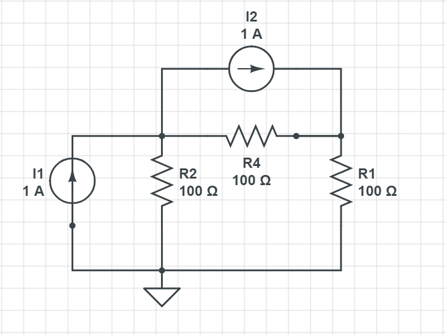
## Step 1

Select a node as the reference node (Essential Node)  
Assign $V_1,V_2,V_3,...,V_{n-1}$ to the remaining nonreference node

## Step 2

Apply **KCL** to each of the n-1 nonreference nodes. User Ohm's law to epress branch currents in terms of node voltages
> Apply KCL to node #1 $I_1 - i_1 - i_2 - I_2 = 0$  
> Apply KCL to node #2 $I_2 + i_2 - i_3 =0$
> $$
> i = \frac{V_{higher} - V_{lower}}{R} = \frac{V_{from}-V_{to}}{R}
> $$  
> $$ 
> i_1 = \frac{V_1}{R_1}, i_2 = \frac{V_1 - V2}{R_2}, i_3 = \frac{V2}{R_3} 
> $$  
> Substitude back to KCL equations
> $$
> I_1 = I_2 + \frac{V_1}{R_1} + \frac{V_1-V_2}{R_2} 
> $$  
> $$
> I_2 + \frac{V_1-V_2}{R_2} - \frac{V_2}{R_3} = 0 
> $$  

## Step 3

Solve the remianing simultaneous equations to find unknown node voltages

## Notes

1. All 3 Laws are used
2. KCL is used at each nonrefernce node
3. Ohm's law is used to determine current in branches
4. KVL is used to determine the voltage drop across resistors

## Example

### Ex 1

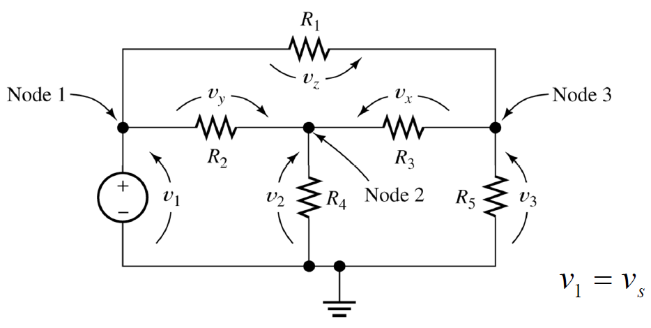

Find KCL equations for nonreference nodes
> KCL at node 1 : Can't
> KCL at node 2 :  
> $$ 
> i_1 = \frac{V_1}{R_1}, i_2 = \frac{V_1 - V2}{R_2}, i_3 = \frac{V2}{R_3} 
> $$  

### Ex 2

Write node-voltage equations (KCL equations)

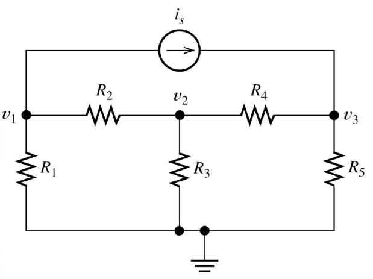

(Let's reference at $v_1 = 0, v_n \to v_{n-1}$)

Apply KCL to node 1  
$$
 \frac{V_1}{R_2} + \frac{V_1-V_2}{R_4} + \frac{V_2-V_3}{R_3} = 0
$$
Apply KCL to node 2  
$$
 -i_s + \frac{V_2-V_3}{R_4} + \frac{V_2-V_1}{R_4} = 0
$$
Apply KCL to node 3
$$
 \frac{V_3}{R_1} + \frac{V_3-V_2}{R_3} + \frac{V_3-V_2}{R_5} = 0
$$

Trick: At node $n$, $V_n$ must be positive

### Ex 3

Find node-voltage equations

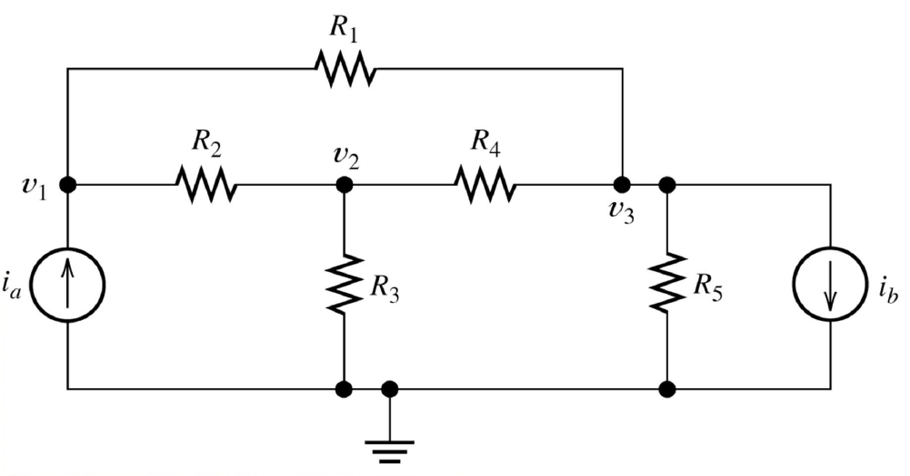

Apply KCL at node 1:
$$
 -i_a + \frac{V_1-V_2}{R_2} + \frac{V_1-V_3}{R_1} = 0
$$
Apply KCL at node 2:
$$
 \frac{V_2-V_3}{R_4} + \frac{V_2}{R_3} + \frac{V_2-V_1}{R_2} = 0
$$
Apply KCL at node 3:
$$
 \frac{V_3-V_2}{R_4} + \frac{V_3-V_1}{R_1} + i_b + \frac{V_3}{R_5} = 0
$$

### Ex 4

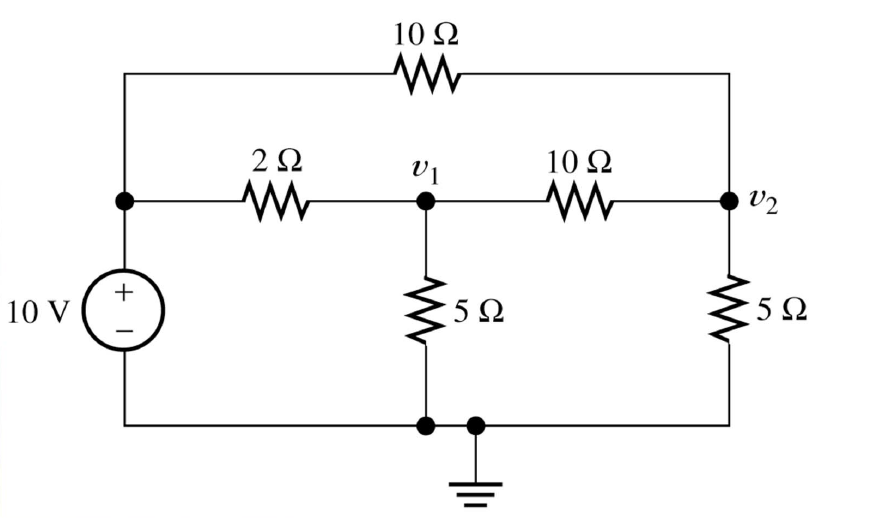

Find node-voltages, $v_1,v_2$

Note: V near source is 10V

Apply KCL at Node 1:
$$
 \frac{V_1 - 10}{2} + \frac{V_1 - V_2}{10} = 0 
$$  
$$
 5V_1 - 50 + V_1 - V_2  = 0 
$$  
$$
 8V_1 - V_2 = 50 \text{1}
$$  

Apply KCL to Node 2:
$$
  \frac{V_2-V_1}{10} + \frac{V_2-10}{10} + \frac{V_2}{5} = 0 
$$
$$
 V_2 - V1 + V_2 - 10 + 2V_2 = 0 
$$
$$
 4V_2 - V_1 = 10 \text{2}
$$  

Eq 2 * 8 
$$
-8V_1 + 32V_2 = 80 \text{3}
$$
Eq 1 + Eq 3
$$
31_2 = 130 \to V_2 = \frac{130}{31} V
$$
$$
V_1 = 4V_2 - 10 = \frac{130\cdot 4}{31} - \frac{310}{31} = \frac{210}{31} V
$$

# Supernodes

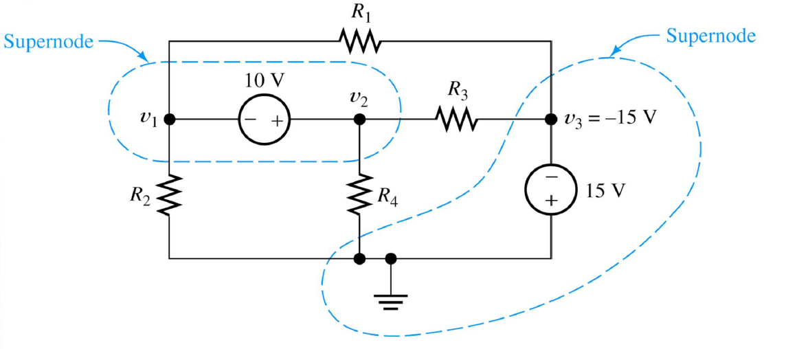

## Type 1

(The one in the bottom)

Try apply KCL to node 1
$$
 \frac{V_1}{R_2} + \frac{V_1-V_3}{R_1} + \frac{V_1-V_2}{R_{10V}} = 0 
$$  
The problem is, we don't know $R_{10V}$, We cannot apply KCL to node 1
Similarly, we can't applyKCL to node 2

## Type 2

(The one on top)

$$ 
\frac{V_1}{R_2} + \frac{V_1-V_2}{R_1} + \frac{V_2-V_3}{R_3} + \frac{V_2}{R_4} = 0 
$$

Still not enough equations !
Apply KVL to the supernode: $V_2 - V_1 = 10$

## Examples

### Ex 1

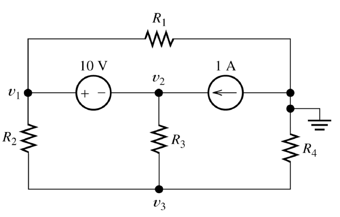

Find $V_1, V_2$ ( Write KCL euqations)

1. Look for voltage sources

Apply KCL to the supernode
$$
 \frac{V_1-V_3}{R_2} + \frac{V_1}{R_1} + \frac{V_2-V-3}{R_3} = 1 
$$

Apply KVL to the supernode: $V_1 - V_2 = 10V$

Apply KCL to node 3
$$
 \frac{V_3-V_1}{R_2} + \frac{V_3-V_2}{R3} + \frac{V_3}{R_4} = 0 
$$

# Special Case II: Dependent Source

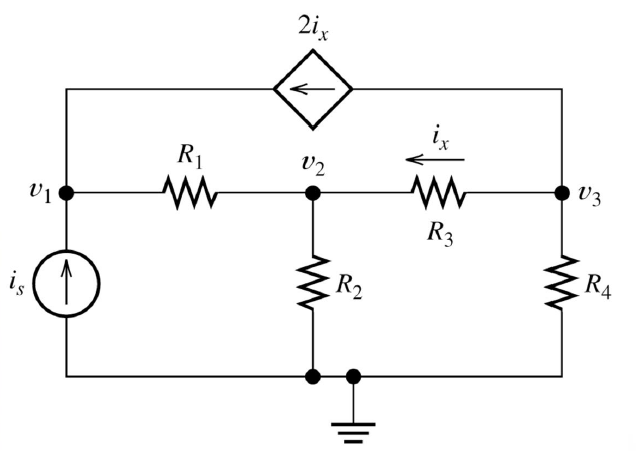

Apply KCL to node 1
$$
 -i_s + \frac{V_1-V_2}{R_1} -2i_x = 0 
$$
Apply KCL to node 2
$$
 \frac{V_2-V_1}{R_1} + \frac{V_2}{R_2} + \frac{V_2-V_3}{R_3} = 0 
$$
Apply KCL to node 3
$$
 \frac{V_3}{R_4} + 2i_x + \frac{V_3-V_2}{R_3} = 0
$$
Find where ix is defined: $i_x = \frac{V_3-V_2}{R_3}$

## Example

### Ex1

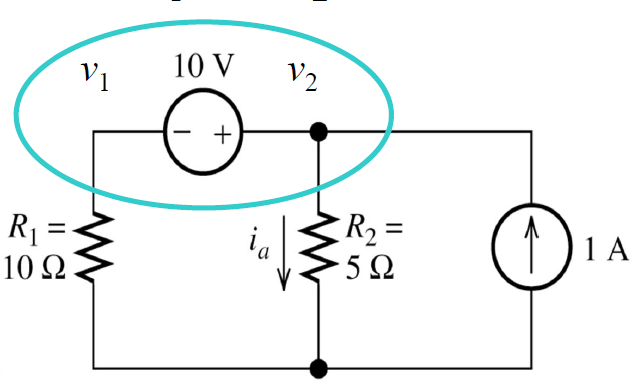

Apply KCL at supernode
$$
 \frac{V_1}{R_1} + \frac{V_2}{R_2} = 1 
$$
$$
 \frac{V_1}{10} + \frac{V_2}{5} = 1 
$$
$$
 V_1 + 2V_2 = 10 \text{1}
$$

Apply KVL to the supernode:  
$$
V_2 - V_1 = 10 \text{2}
$$

2(1) + (2):
$$
 V_2 = \frac{20}{3} V \to V_1 = -\frac{10}{3}V 
$$

### Ex2

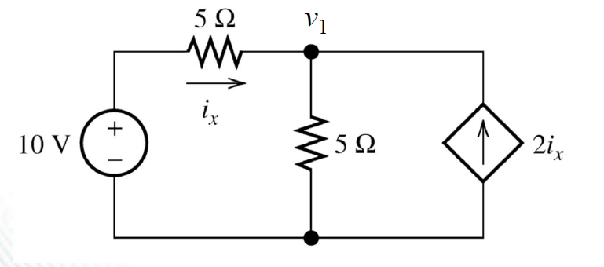

Apply KCL to node 1:
$$
 \frac{V_1}{10} + \frac{V_1}{5} - 2i_x = 0
$$
Find $i_x$
$$
 i_x = \frac{10-V_1}{5} 
$$
Combine:
$$ 
\frac{V_1-10}{5} + \frac{V_1}{5} \to \frac{10-V_1}{5} = 0 \to V_1 = 10 + V_1 - 20 + 2V_1 = 0 
$$
$$
 V_1 = 7.5V , i_x = 0.5A 
$$

# Excercies

## Question 1

Find $v_1, v_2$ and $i_b$

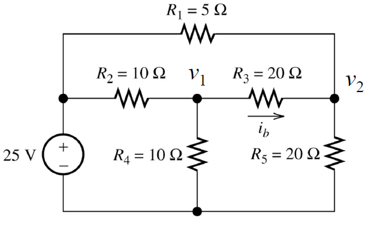

KCL at node 1:
$$
\frac{V_1-25}{10} + \frac{V_1}{10} + \frac{V_1-V_2}{20} = 0 
$$
$$
 2V_1 - 50 + 2V_1 + V1_1 - V_2 = 0 
$$
$$
 5V_1 - V_2 = 50 
$$
KCL at node 2:
$$
\frac{V_2}{20} + \frac{V_2-V_1}{20} + \frac{V_2-25}{5} = 0 
$$
$$
 V_2 + V_2 - V_1 + 5V_2 - 125 = 0
$$
$$
 6V_2 - V_1 = 100
$$

Calculator magic: $v_1 = 13.79; v_2 = 18.96; i_b = \frac{13.97-19.85}{20} = -0.294$

## Question 2

Find i_y

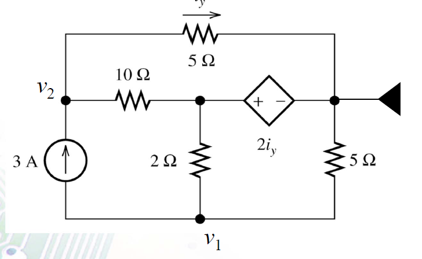

At node 1  ( not used lol )
$$
 \frac{V_1-2i_y}{2} + \frac{V_1}{5} = -3 
$$  
$$
 7V_1-10i_y = -30 \text{1} 
$$  
At node 2  
$$
 \frac{V_2}{5} + \frac{V_2-2i_y}{10} = 3
$$  
$$
 3V_2 - 2i_y = 30 \text{3}
$$  
Definition of $i_y = \frac{V_2}{5}$  
$$
 5i_y - v_2 = 0 \text{3}
$$  
calculator magic: $i_y = 2.30 A$