- [Mesh-current analysis](#mesh-current-analysis)
- [Planar Circuit](#planar-circuit)
- [Non planar circuit](#non-planar-circuit)
- [Difference between mesh and loop](#difference-between-mesh-and-loop)
- [Difference between branch current and mesh current](#difference-between-branch-current-and-mesh-current)
- [Mesh Analysis](#mesh-analysis)
  - [1. Assign mesh currents. $i_1,i_2...i_n$](#1-assign-mesh-currents-i1i2in)
  - [2. Apply KVL to each mesh. Use Ohm's law to express voltages in terms of mesh currents](#2-apply-kvl-to-each-mesh-use-ohms-law-to-express-voltages-in-terms-of-mesh-currents)
  - [3. Solve the simultaneous equations](#3-solve-the-simultaneous-equations)
- [Examples](#examples)
  - [Example 1](#example-1)
  - [Example 2](#example-2)
  - [Example 3](#example-3)
  - [Example 4](#example-4)
    - [Method 1: Mesh analysis](#method-1-mesh-analysis)
    - [Method 2 : Node analysis](#method-2--node-analysis)
    - [Method 3 : Combining Resistances](#method-3--combining-resistances)
- [Mesh Analysis with Current Source](#mesh-analysis-with-current-source)
  - [Speical Case 1](#speical-case-1)
  - [Special Case 2 : Super mesh](#special-case-2--super-mesh)
  - [Example](#example)
  - [Example with Dependent source](#example-with-dependent-source)
    - [Question 1](#question-1)
    - [Question 2](#question-2)
    - [Question 3 (Last boss)](#question-3-last-boss)
- [Summary](#summary)
  - [Choosing Method](#choosing-method)

# Mesh-current analysis

- find mesh currents
- can only be applied to **planar** circuit
- Planar circuits if the circuit can be drawn in a plane, otherwise the circuit is **non-planar**
- A Circuit may have crossing branches and still be panar if it can be drawn such that it has no crossing branches

# Planar Circuit

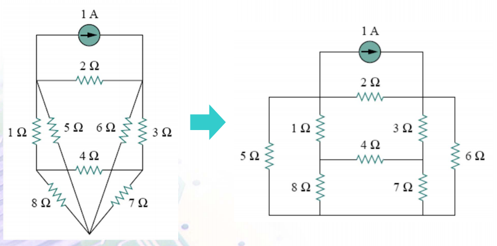

# Non planar circuit
 
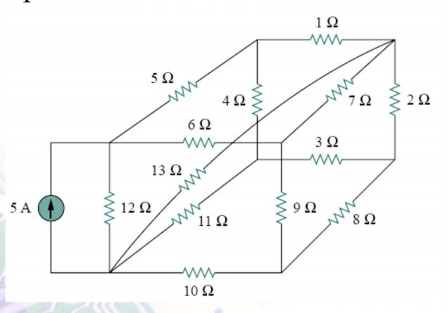

# Difference between mesh and loop

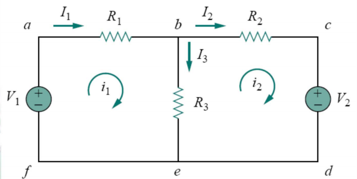

**Loops**: abcdefa, bcdeb, abcdefa  
**Mesh**: A loop which does not contain any other loop within it
**Mesh analysis**: We only apply KVL to meshes.

# Difference between branch current and mesh current

$I_1,I_2,I_3$ are branch currents
$$
 V_3 = i_3 \cdot R_3 
$$
$i_1, i_2$ are node currents  
throuch $R_3$ there are two mesh currents
$$
 V_3 = (i_1 - i_2) \cdot R_3 
$$

# Mesh Analysis

3 Steps

## 1. Assign mesh currents. $i_1,i_2...i_n$

## 2. Apply KVL to each mesh. Use Ohm's law to express voltages in terms of mesh currents

Apply KVL to mesh 1
$$
 -V-1 + i_1R_1 + (i_1-i_2)R_3 = 0 
$$

Apply KVL to mesh 2
$$
 (i_2-i_1)R_3 + i_2R_2 + V_2 = 0 
$$

## 3. Solve the simultaneous equations

# Examples

## Example 1

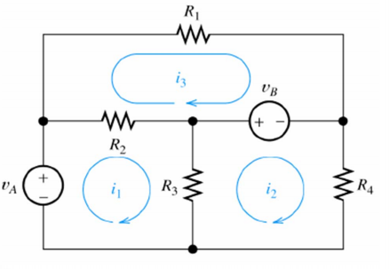

Apply KVL to mesh 1

$$
 -v_1 + (i_1-i_3)R_2 + (i_1-i_2)R_3 = 0 
$$

Apply KVL to mesh 2

$$
 (i_2-i_1)R_3 + v_b + i_2R_4 = 0 
$$

Apply KVL to mesh 3

$$
 i_3R_1 - v_b + (i_3-i_1)R_2 = 0 
$$

## Example 2

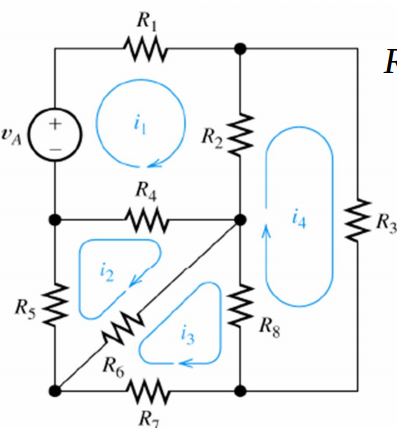

Apply KVL to mesh 1,2,3,4

$$
 -V_a + i_1R_1 + (i_1-i_4)R_2 + (i_1-i_2)R_4 = 0 
$$  
$$
 i_2R_5 + (i_2-i_1)R_4 + (i_2-i_3)R6 = 0 
$$  
$$
 (i_3-i_2)R_6 + (i_3-i_4)R_8 + i_3R_7 = 0 
$$  
$$
 (i_4-i_1)R_2 + (i_4-i_3)R_8 + i_4R_3 = 0 
$$  
 
## Example 3

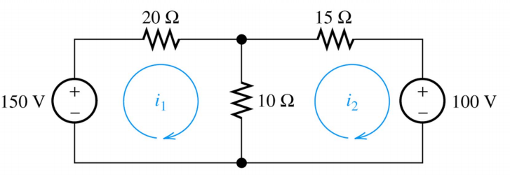

$$
 -150 + 20i_1 + 10(i_1-i_2) = 0 
$$
$$
 10(i_2-i_1) + 15i_2 + 100 = 0 
$$

Convert to standard form

$$
 30i_1 - 10i_2 = 150 
$$
$$
 -10i_1 + 25i_2 = 100 
$$

Using **matrix** to solve

$$
\Delta = \begin{vmatrix} 30 & -10 \\ -10 & 25 \end{vmatrix} = 750 - 100 = 650
$$
$$
\Delta_1 = \begin{vmatrix} 150 & -10 \\ -100 & 25 \end{vmatrix} = 3750 - 1000 = 2750
$$
$$
\Delta_2 = \begin{vmatrix} 30 & 150 \\ -10 & -100 \end{vmatrix} = -3000 + 1500 = -1500
$$

$$
 i_1 = \frac{\Delta_1}{\Delta} = 4.23 
$$
$$
 i_2 = \frac{\Delta_2}{\Delta} = -2.31 
$$

## Example 4

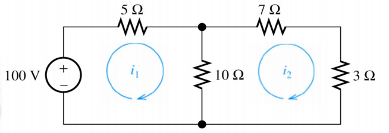

### Method 1: Mesh analysis

Apply KVL to mesh 1: $-100 + 5i_1 + 10(i_1-i_2) = 0 \text{    (1)}$  
Apply KVl to mesh 2: $10(i_2-i_1) + 7i_2 + 3i_2 = 0 \text{    (2)}$  
Algebra **magic** $i_1 = 5A ; i_2 = 10A$

### Method 2 : Node analysis

Apply KCl at node 1 : 
$$
 \frac{V_1 - 100}{5} + \frac{V_1}{10} + \frac{V_1}{10} = 0 
$$  
$$
 V1-100 + V_1 = 0 \to V_1 = 50 
$$
$$
 i_1 = \frac{50}{10} = 5 
$$

### Method 3 : Combining Resistances

$$
 V_2 = 100 \frac{5}{5+5} = 50V 
$$
$$
 i_{100\Omega} = \frac{V_2}{10} = 5A 
$$

# Mesh Analysis with Current Source

## Speical Case 1

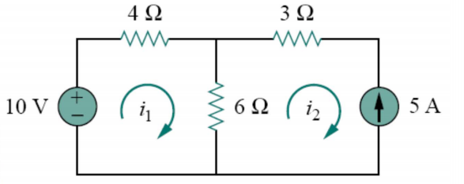
Apply KVL to mesh 1: $-10 + 4i_1 + 6(i_1-i_2) = 0$
$$
 i_2 = -5A 
$$

$\implies$ If a current source exists in one mesh. The mesh current equals to the value of current source. Write KVl equations in the same way to other meshes

## Special Case 2 : Super mesh

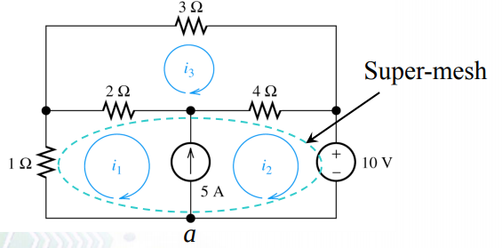

**Supermesh**: Comine meshes 1 and 2 into a super mesh  
**Important note**: A supermesh does not have current of its own. (We'll just use $i_1$ and $i_2$)

Apply KVL to the supermesh:
$$
 i_1 + 2(i_1-i_3) + 4(i_2-i_3) + 10 = 0 
$$
Apply KVL to mesh 3:
$$
 3i_3 + 2(i_3-i_1) + 4(i_3-i_2) = 0 
$$
Apply KCL to node a (our third magical equation):
$$
 i_2 - i_1 = 5 
$$

## Example

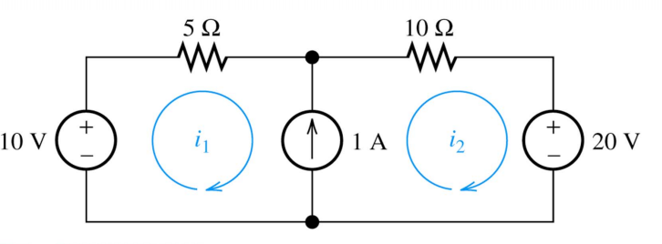

Apply KVl to the supermesh:
$$
 -10 + 5i_1 + 10i_2 + 20 = 0 \to i_1 + 2i_2 = -2
$$
Apply KCL to node a:
$$
 i_2 - i_1 = 1 
$$

Algebra magic: $i_2 = -\frac{1}{3}A, i_1 = -\frac{4}{3}A$

## Example with Dependent source

### Question 1

KVL at the supermesh:
$$
 -20 + 4i_1 + 6i_2 + 2i_2 = 0 
$$
KCL at node a:
$$
 i_2 - i_1 = \frac{v_x}{4} 
$$
Definition of $v_x$:
$$
 v_x = 2i_2 
$$

### Question 2

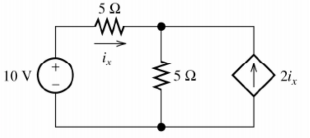

KVL at the mesh 1:
$$
 -10 + 5i_1 + 5(i_1-i_2) 
$$
Defintion of $i_2 = -2i_x = -2i_1$

Putting it all together:
$$
 -10 + 5i_1 + 5(3i_1) = 0
$$
$$
 20i_1 = 10 \to i_1 = i_x = 0.5A 
$$

### Question 3 (Last boss)

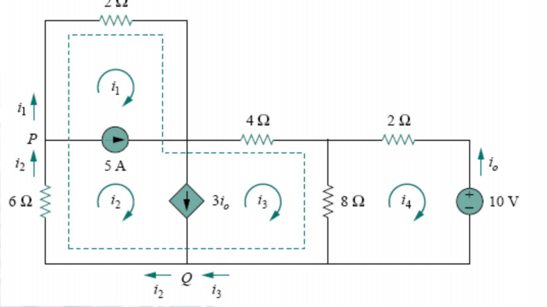

KVL at the supernode:
$$
 2i_1 + 4i_3 + 6i_2 = 0 \text{ -- (1)}
$$
KCL at mesh 4:
$$
 2i_4 + 10 + 8(i_4-i_3) = 0 \text{ -- (2)}
$$
KCL at node P:
$$
 i_2 = i_1 + 5 \text{ -- (3)}
$$
KCL at node Q:
$$
 i_3 + 3i_o = i_2 \text{ -- (4)}
$$
Definition of $i_o$:
$$
 i_o = -i_4 
$$

# Summary

1. Properly draw the circuit and define mesh currents 
2. Write network equation stop if number of equations is equal to mesh
3. If we got dependent source. Go see where it is defined
4. Put equations in standard forms
5. Use value you\ get to calculate anything you want

## Choosing Method

- Depends on information required
  - Node voltages -> nodal analysis
  - Branch or mesh currents -> mesh analysis
- Node analysis is more oftern used
- Choose the one that has the least equations
  
|                    | Nodal Analysis  | Mesh Analysis   |
| ------------------ | --------------- | --------------- |
| Method             | KCL             | KVL             |
| Solve For          | Node Voltage    | Mesh Currents   |
| "Super" Conditions | Voltage Sources | Current Sources |