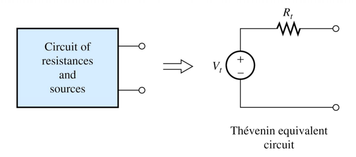
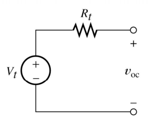
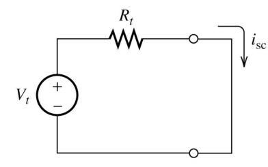
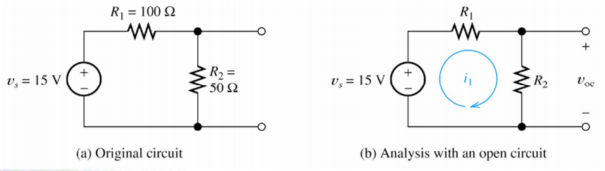
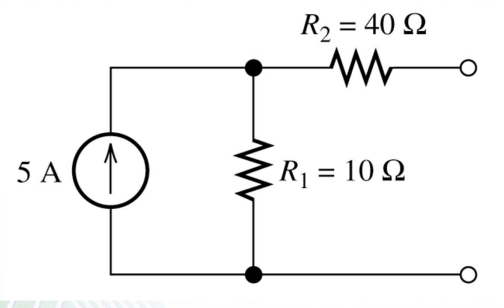
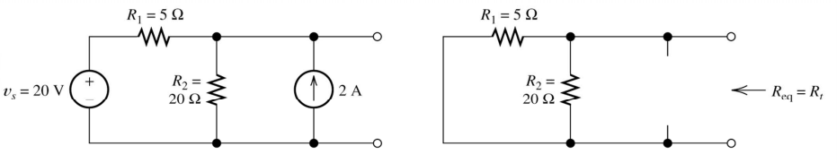
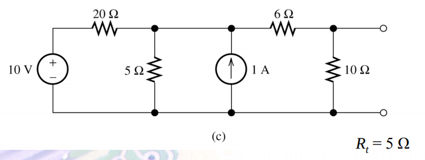
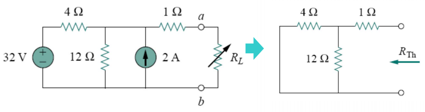
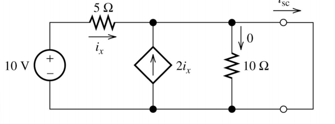
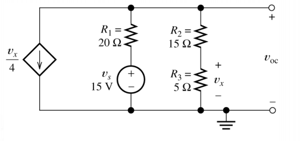

- [Thevenin and Norton Equivalent Circuits](#thevenin-and-norton-equivalent-circuits)
- [Steps](#steps)
    - [Step 1: The Thevenin voltage $V_t$ is equal to the open circuit voltage $V_oc$](#step-1-the-thevenin-voltage-vt-is-equal-to-the-open-circuit-voltage-voc)
    - [Step 2: Find the short circuit current](#step-2-find-the-short-circuit-current)
    - [Step 3 : Solve for the Thevienin resistance $R_t$](#step-3--solve-for-the-thevienin-resistance-rt)
    - [Example](#example)
    - [Excercise](#excercise)
- [Find Thevenin resistance directly](#find-thevenin-resistance-directly)
    - [Example 1](#example-1)
    - [Example 2](#example-2)
    - [Example 3](#example-3)
- [Thevenin with Dependent Source](#thevenin-with-dependent-source)
- [Norto Equivalent Circuit](#norto-equivalent-circuit)
- [Example](#example)

# Thevenin and Norton Equivalent Circuits

**Thevenin's Theorem**: A linear two-terminal circuit can be replaced by an equivalent circuit containing a voltage source $V_t$ in series with a resistor, $R_t$  
$V_t$: the open-circuit voltage at the terminals  
$R_t$: input or equivalent resistance at the terminals when independent sources are turned off  

# Steps

## Step 1: The Thevenin voltage $V_t$ is equal to the open circuit voltage $V_oc$

$$ 
V_t = V_{oc}
$$

## Step 2: Find the short circuit current

## Step 3 : Solve for the Thevienin resistance $R_t$

$$
R_t = \frac{V_{oc}}{i_{sc}}
$$

## Example

Step 1: Find $V_{oc}$
Step 2: Find $i_{sc}$

$$
\begin{aligned}
V_1 &= V_2 \\
i_2 &=\frac{V_1-V_2}{R_2} = 0 \\
i_{sc} &= \frac{V_s}{R_1} = 0.15 A
\end{aligned}
$$

Step 3: $R_t = \frac{V_{oc}}{i_{sc}} = \frac{5}{0.15} = 33.3\Omega$

## Excercise

Find Thevenin equivalent circuit.

Step 1: Find $V_{oc}$ : $V_{oc} = 5 \times10 = 50V$

Step 2: Find $i_{sc}$

Apply current division
$$
i_{sc} =  5\times \frac{10}{40+10} = 1
$$

Step 3:$R_t = \frac{V_{oc}}{i_{sc}} = \frac{50}{1} = 50\Omega$

# Find Thevenin resistance directly

By Zerioing the sources in the original circuit and thencomputing the resistance between the terminals

When Zeroing a voltage source, it becomes a short circuit $V_s \to 0 \to \text{ short circuit }$
When zeroing a current source. it becomes a open circuit. $i_s \to 0 \to \text{ open circuit }$

## Example 1

Step 1: $R_{eq} = \frac{100}{35} = 4$

Step 2:  
Apply KCL at node 1:
$$
\begin{aligned}
\frac{V_1-20}{5} + \frac{V_1}{20} &= 2 \\
4V_1 - 80 + V_1 &= 40 \to V_t = 24 V \\
V_t = V_{oc} &= V_1 = 24V
\end{aligned}
$$

* Condition of finding thevenin resistance directly is that thecircuit only cantains independent sources.

## Example 2

Step 1: $R_{eq} = 5_V$ (Combine resistances as usual)

## Example 3
Find I on R_t for various value of R

Use Thevenin :

Step 1: $R_t = 4$  
Step 2: $V_t \to$ Node-Voltage magic = 30  

# Thevenin with Dependent Source

Step 1 : Find $V_{oc}$

Apply KCL to node 1 :

$$
\frac{V_1-10}{5} - 2i_x + \frac{V_1}{10} = 0
$$

Also,

$$ 
i_x = \frac{10-V_1}{5}
$$

Solve for $V_1 = 8.57$

Step 2: Find $i_{sc}$

Apply KCL at node 2:
$$  
i_x + 2i_x = i_{sc}
$$

Stuck !, Look at circuit again. By observing

$$ 
\begin{aligned}
i_x &= \frac{10-0}{5} = 2A \\
i_{sc} &= 6A
\end{aligned}
$$

Step 3: $R_t = \frac{V_{oc}}{i_{sc}} = \frac{8.57}{6} = 1.43\Omega$

# Norto Equivalent Circuit

$V_oc,(V_t), i_{sc}(I_n), R_t$

Thevenin/ Norton Equivalent circuit Analysis Perform two of this

- Find open-circuit voltage $V_oc = V_t$
- Find short-circuit current $I_n = i_{sc}$
- Zero sources (independent) find $R_t$

$$
R_t = \frac{V_t}{I_n}
$$

# Example

Step 1 : find $V_{oc}$

Apply KCL

$$
\begin{aligned}
\frac{V_x}{4} + \frac{V_{oc}-15}{20} + \frac{V_{oc}}{20} &= 0 \\
V_x = V_{oc}\frac{5}{15+5} &= \frac{1}{4}V_{oc}
\end{aligned}
$$