- [A Brief Review](#a-brief-review)
- [Superposition Principle](#superposition-principle)
  - [Linearilty Property](#linearilty-property)
    - [Linear Example](#linear-example)
    - [Non-Linear Example](#non-linear-example)
- [Application](#application)
- [Examples](#examples)
    - [Example 1](#example-1)
  - [Example 2](#example-2)
- [(Actual) Superposition Principle](#actual-superposition-principle)
- [Proof of Superposition Principle](#proof-of-superposition-principle)
  - [Approach 1 : Superposition Principle](#approach-1--superposition-principle)
    - [1. Consider only $V_{s1}$](#1-consider-only-vs1)
    - [2. Consider only $i_s{2}$](#2-consider-only-is2)
    - [3. Math magic](#3-math-magic)
  - [Approach 2 : Node-voltage Analysis](#approach-2--node-voltage-analysis)
- [Examples](#examples)
  - [Example 1](#example-1)
  - [Example 2](#example-2)
  - [Example 3](#example-3)

# A Brief Review

- Week 1 : Introduction to circuit elements definitions ( charge, current, voltage) Ohm's law, KCL, KVL
- Week 2 : Circuit anaysis by combining resistances in series and parallel
- Week 3 : Node-Voltage Analysis
- Week 4 : Mesh-current analysis
- Week 5 : Thevening and Norton Equivalent Circuits

Advantages of KCL and KVL is that we can analyze a circuit without changing its original configuration

A major disadvantage is that for a large complex circuit, tedious computation is involved.

# Superposition Principle

## Linearilty Property

### Linear Example

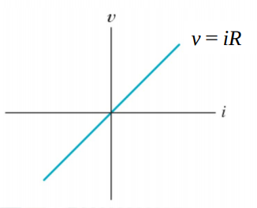

### Non-Linear Example

$$
\begin{aligned}
v &= 10i^2 \\
i_{cs} &= K\cos(i_x) \\
i &= e^v
\end{aligned}
$$
The super position Principle does not apply to any circuit that has element described by non-linear equation

**Linearity** is a property ( describes a linear relationship )between cause and effect

A combination of **homogeneity** (scaling) and **Additivity**

The **homogeneity** property requires that if the input
(also called the excitation) is multiplied by a constant,
then the output (also called the response) is multiplied
by the same constant.

Given a function $f(x)$:
$$
\begin{aligned}
y &= f(x) \\
y_1 &= f(x_1) \\
y_2 &= f(x_2)
\end{aligned}
$$
The function $y = f(x)$ is linear if and only if
$$ 
f(a_1x_1 + a_2x_2) = a_1y_1 + a_2y_2
$$
for any two inputs $x_1$, and $x_2$, and any constant $a_1$ and $a_2$

For resistor Ohm's law $V=iR$  
If we multiply $i$ by a constant $k$
$$
kiR = kV
$$
Satisfies homegeneity  

If $V_1 = i_1R_1$ and $V_2 = i_2R$

$$
(i_1+i_2)R = i_1R +i_2R = V_1+V_2
$$
Ohm's law is linear

In general, a circuit is linear if it is both **additive** and **homogenous**

A linear circuit is one whose **output** is **linearly related** to its **input**

A linear circuit consists of only **linear elements**, **linear dependent sources**, and **independent sources**, resistances.

Power dissipated by a resistor as a function of current
$$ 
\begin{aligned}
P &= f(i) = i^2R \\
P_1 &=i_1^2R, P_2=i_2^2R \\
f(a_1i_1 + a_2i_2 ) &= (a_1i_1 + a_2i_2)^2R \\
&=  a_1^2i_1^2R + 2a_1a_2i_1i_2T + a_2^2i_2^2R \\
&\neq a_1P_1 + a_2P_2
\end{aligned}
$$
This relation is **non linear**

To find power using superposition, we can find voltage using superposition principle first then $P = vi$

# Application

a linear circuit with input $V_s$ and output $i$

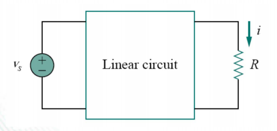

Suupose $V_s = 10V$, gives $i = 2A$. According to the liinearity Principle. $V_s = 1V$ will give $i = 0.2A$

By the same token, $i=1mA$ must be due to $V_s = 5mV$

# Examples

### Example 1

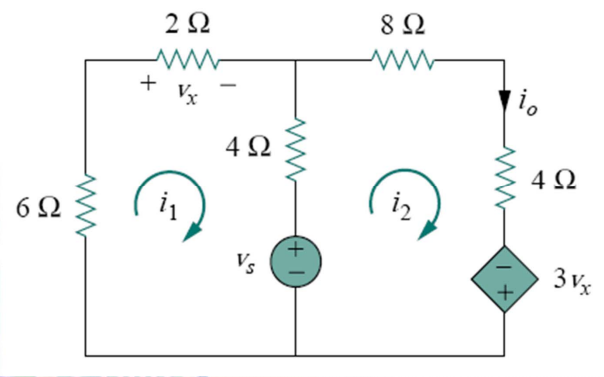

Find $i_o$ when $V_s = 12V$ and $V_s = 24V$

input: $V_s$, output: $i_0$

Apply KVL to two nodes:
$$
\begin{aligned}
    6i_1 + 2i_1 + 4(i_1 -i_2) + V_s &= 0 \\
    4(i_2 - i_1) + 8i_2 + 4i_2 - 3V_x - V_s &= 0
\end{aligned}
$$

Also $2V_x = 2i$, solve for $i_o = i_2 = \frac{V_s}{76}$

if $V_s = 12V, i_o = \frac{12}{76}A$  
if $V_s = 24V, i_o = \frac{24}{76}A$

(1 Example skipped)

## Example 2

Assume $I_o = 1A$ user linearity to find the actual value of $I_o$

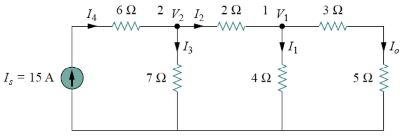

If $I_o = 1A$, then $V_1 = (3 + 5)I_o = 8V \to I_1 = \frac{V_1}{4} = 2A$

KCL: $I_2 = I_1 + I_o = 3A \to V_2 = 2I_2 + V_1 = 14V \to I_3 = \frac{V_2}{7} = 2A$  
KCL: $I_4 = I_2+I_3 = 5A$ Assume $I_o = 1A \to I_s = 5A$  
In fact $I_s = 15A$, the actual value of $I_o$ is $3A$

# (Actual) Superposition Principle

If a circuit has two or more independen sources, one way to determine the value of a specific variable (voltage or current) is to use node-voltage or mesh-current analysis.

Another way is to determine the contribution of each independen source to the variable and then add them up. The approach is known as the *superposition*.

Consider a single independent source at a time

# Proof of Superposition Principle

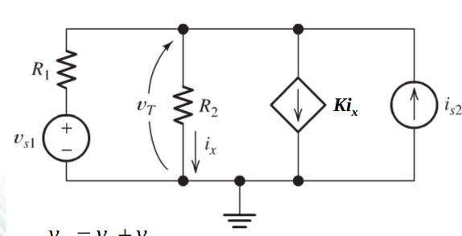

## Approach 1 : Superposition Principle

Turn off independent sources

Voltage source $\to$ Short circuit  
Current source $\to$ Open circuit

### 1. Consider only $V_{s1}$

Apply KCL
$$
\begin{aligned}
\frac{V_{T1} - Vs1}{R_1} + \frac{V_{T1}}{R_2} + K\frac{V_{T1}}{R_2} &= 0 \\
R_2V_{T1} - R_2V_{s1} + R_1V_{T1} + kR_1V_{T1} &= 0
\end{aligned}
$$

### 2. Consider only $i_s{2}$

Apply KCL
$$
\begin{aligned}
\frac{V_{T2}}{R_1} = \frac{V_{T1}}{R_2} + K\frac{V_{T1}}{R_2} &= i_{s2} \\
R_2V_{T2} + R_1V_{T2} + kR_1V_{T2} &= R_1R_2i_{s2}
\end{aligned}
$$

### 3. Math magic

$$
V_T = V_{T1} + V_{T2} = \frac{R_2}{R_1+R_2+kR_1}V_{s1} + \frac{R_1R_2}{R_1 + R_2 + kR_1}i_{s2}
$$

## Approach 2 : Node-voltage Analysis

Apply KCL:
$$
\begin{aligned}
\frac{V_T - V_{s1}}{R_1} + \frac{V_T}{R_2} + k\frac{V_T}{R_2} - i_{s2} &= 0 \\
R_2V_T - R_2V_{s1} + R_1V_T + kR_1V_t - R_1R_2i_{s2} &= 0 \\
R_1V_t + R_2V_T + kR_1V_T &= R_2V_{s1} + R_1R_2i_{s2} \\
V_T &= \frac{R_2}{R_1+R_2+kR_1}V_{s1} + \frac{R_1R_2}{R_1 + R_2 + kR_1}i_{s2}
\end{aligned}
$$

# Examples 

## Example 1

Find $V_T$ using superposition principle
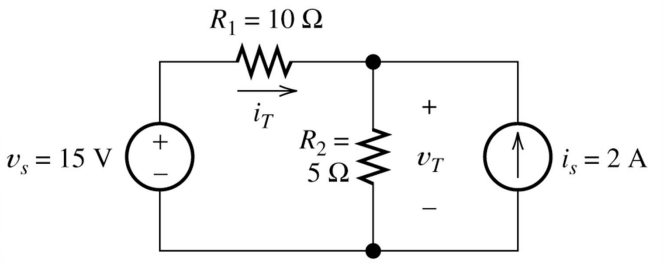

Step 1 Keep $v_s$

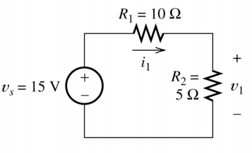

Step 2 Keep $i_s$

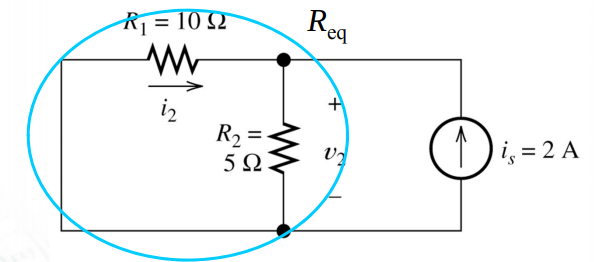

## Example 2

Find $i_o$ using superposition

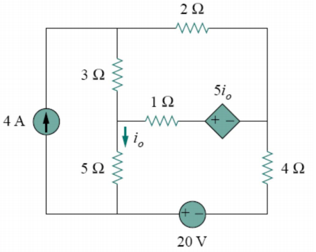

**Step 1** Keep Current source

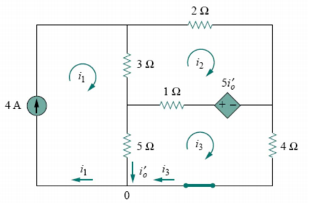

Apply KVL to mesh 2 :
$$
3(i_2-i_1) + 2i_2 - 5i_o' + (i_2-i_3) = 0
$$

Apply KVL to mesh 3 : 
$$
5(i_3-i_1) + (i_3-i_2) + 5i_o' + 4i_3 = 0
$$

Solving...

$$
i_o' = i_1 - i_3 \to i_o' = \frac{52}{17}A
$$

**Step 2** Keep only Voltage source

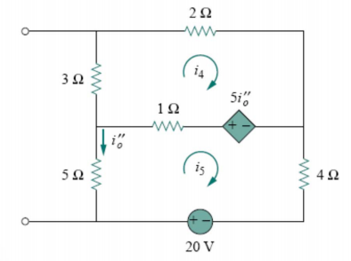

KVL mesh 4:
$$
5i_5 - 5i_o'' + i_4 - i_5 = 0
$$
KVL mesh 5:
$$
5i_5 + (i_5-i_4) + 5i_o'' + 
$$

**Step 3** Calculate
$$
i_o = i_o' + i_o'' = \frac{52}{17} + (-\frac{60}{17}) = -\frac{8}{17}A
$$

## Example 3 

Find $i$ using Superposition

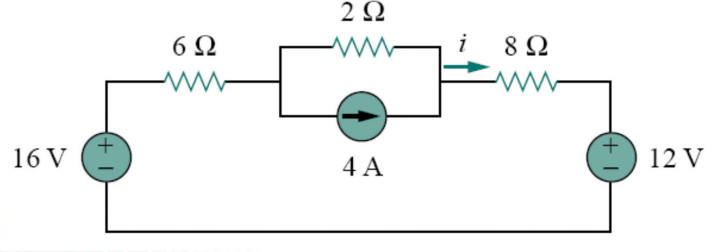

**Step 1** Keep 16V
$$ 
i_1 = \frac{16}{16} = 1A
$$
**Step 2** Keep 12V
$$
i_2 = \frac{16}{12} = -0.75A
$$
**Step 3** Keep 4A 

Using Current Division
$$ 
i_3 = \frac{2}{14} \cdot 4 = 0.5{A}
$$

**Step 4** Calculate
$$
i = i_1 + i_2 + i_3 = 1 -0.75 + 0.5 = 0.75 A
$$